<!--
Profile README for ymx10086
Tip: keep it concise; pin the most representative repos on your profile page too.
-->

<!-- 
[Homepage](https://ymx10086.github.io/) ·
[Google Scholar](https://scholar.google.com/citations?user=iaBA__IAAAAJ) ·
[ORCID](https://orcid.org/0009-0004-0700-8299) ·
[Group](https://www.icst.pku.edu.cn/NetVideo/) -->

<!-- ---

## 👋 About Me 

- 🎓 Computer Science & Technology student (Beijing)

<!-- > 我可能回复较慢，但欢迎交流合作 / 讨论想法 🤝 -->
<!-- > I may be slow to respond, but welcome to connect, collaborate, or discuss ideas.

<!-- 
## 📨 Contact 
- Homepage: https://ymx10086.github.io/
- Email: mxyang25@stu.pku.edu.cn -->

<!--
Optional: Recent activity section (auto-updated by GitHub Actions)
-->
## 🕒 Recent Activity

- 🎓 Currently pursuing a **PhD degree**, with a focus on AI and security-related research.
- 🚀 Actively exploring **AI entrepreneurship**, interested in turning research ideas into real-world products and startups.

<!--START_SECTION:activity-->
<!--END_SECTION:activity-->
